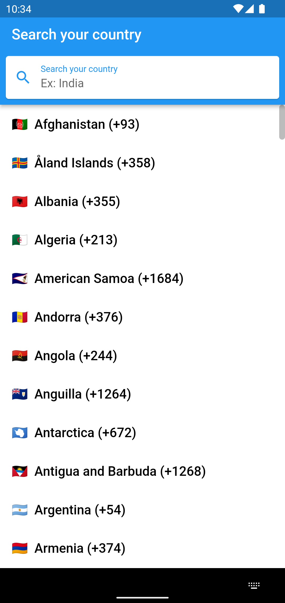

# Flutter with Firebase

This repo consists of the implementation of all firebase features in a flutter application.

### Status

| Feature                            | Android | iOS      |
|------------------------------------|---------|----------|
| [Phone Auth](/lib/ui/screens/auth) | Tested  | Untested |
| [Chat](/lib/chat)                  | Tested  | Untested |

### Screenshots

#### Select Country Screen

  

### Configuration

1. Clone the repository
2. Create a project in firebase and connect the app to
   firebase [How to?](https://medium.com/@fayaz07/firebase-phone-auth-with-flutter-db7e934ef46f) (
   Check the first part of the article)
3. Add SHA1 key, check this [link](https://developers.google.com/android/guides/client-auth) for
   more info
   For debug version, run this command in your terminal:
    ```
    keytool -list -v -keystore ~/.android/debug.keystore -alias androiddebugkey -storepass android -keypass android
    ```

   For release version, run this command in your terminal replacing the keystore_name and
   alias_name:
    ```
    keytool -list -v -keystore {keystore_name} -alias {alias_name}
    ```
4. Enable Authentication **Sign-in providers** in firebase dashboard (as per your requirement)
5. Install the app

### Contributions || Issues

Feel free to open PR or issues